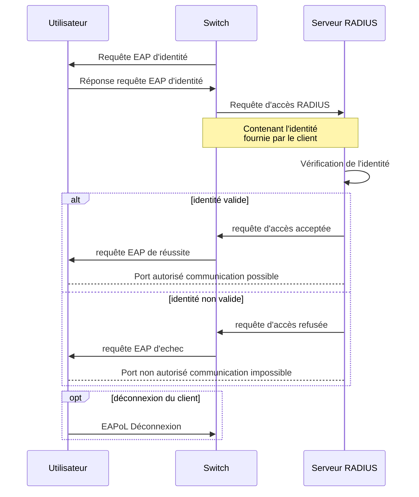

# Schéma de séquence 802.1x

Dans notre cas, le client est n'importe quel device qui essaie de se connecter au switch via un cable Ethernet, il s'agit du supplicant (suppliant/demandeur en français). Le switch lui est notre NAS (Network Access Server), les NAS sont tous les composants permettant à un utilisateur de se connecter au réseau, le switch en fait donc partie, un autre exemple serait un point d'accès wifi. En dernier il-y-a le serveur AAA (Authentication, Authorization, Accounting) il se charge de valider ou non l'accès au réseau pour les utilisateurs se connectant, il se charge également de leur attribués les différents accès et il est également capable de faire de la comptabilité i.e. compter le nombre de netdata utilisé par un utilisateur.

Le schéma ci-dessous démarre dès lors qu'un utilisateur se branche en RJ45 sur notre switch Cisco Catalyst 2960 Plus Series.

