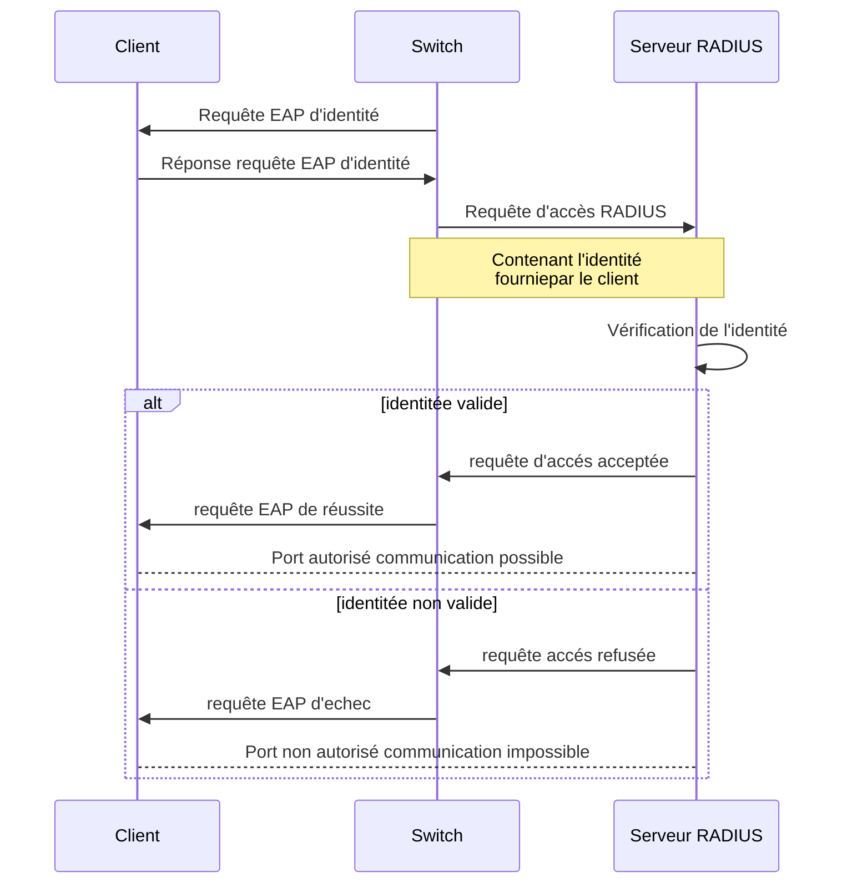

# Schéma de séquence 802.1x

```mermaid 
  sequenceDiagram
  	participant C as Client
    Participant S as Switch
    Participant SR as Serveur RADIUS
    S->>C: Requête EAP d'identité
    C->>S: Réponse requête EAP d'identité 
    S->>SR: Requête d'accès RADIUS
    Note over S,SR: Contenant l'identité <br> fourniepar le client
    SR->>SR: Vérification de l'identité
    alt identitée valide
    	SR->>S: requête d'accés acceptée
      S->>C: requête EAP de réussite
      C-->SR: Port autorisé communication possible
    else identitée non valide
    	SR->>S: requête accés refusée
      S->>C: requête EAP d'echec
      C-->SR: Port non autorisé communication impossible
    end
```